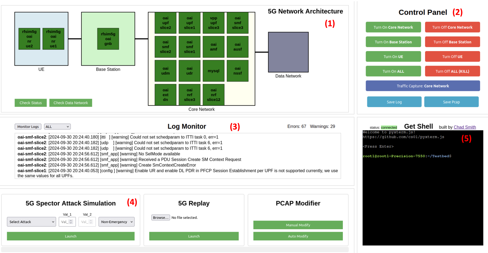

# MobiDojo

MobiDojo is a Virtual Security Combat Platform for 5G Cellular Networks that supports one-click 5G deployment and security testing with web-based graphical user interfaces. It is built on entirely virtual (i.e., no radio hardware required) open-source software - the [OpenAirInterface](https://gitlab.eurecom.fr/oai/openairinterface5g/)'s 5G stack deployed as Docker containers. Running MobiDojo does not require **any** radio hardware as it fully leverage OAI's RF emulation capability while still provide an end-to-end and standard-compliant 5G network for protocol-level security testing and experiments.

If you want to learn about the details of MoboDojo, please checkout our [technical paper](https://onehouwong.github.io/papers/MobiDojo_FutureG25.pdf) (in FutureG'25 workshop) and our [demo video](https://www.5gsec.com/post/mobidojo-a-virtual-security-combat-platform-for-5g-cellular-networks).


## Quick Start

MobiDojo can be easily installed on any commodity Linux (e.g., Ubuntu) machines with simple steps:

```
git clone https://github.com/5GSEC/MobiDojo.git
./install_dependencies.sh
python3 app.py
```

## Major Interfaces and Functions

The picture below shows the interfaces of an intial release of MobiDojo.



Currently MobiDojo supports the following capabilities:

- (1) 5G network topology visualization.
- (2) Control panel for quick network deployment, control, and packet capture (pcap).
- (3) Log monitor for run-time 5G container logs.
- (4) Security testing functions, including: (I) Pre-configured Attack execution and testing. The attack implementations are from our prior work [5G-Spector](https://github.com/5GSEC/5G-Spector). (II) Self-defined Attacks that allows you to create and evaluate arbitrary pcap-based attacks which are replayed through [5G-Replay](https://github.com/Montimage/5Greplay). *This is still a beta feature*.
- (5) An integrated Shell terminal for fine-grained control.


## Acknowledgement

It would not have been possible for us to develop MobiDojo without the following amazing open-sourced projects:

- [OpenAirInterface](https://gitlab.eurecom.fr/oai/openairinterface5g/)
- [5G-Replay](https://github.com/Montimage/5Greplay)

## Publication

```
@inproceedings{MobiDojo:FutureG25,
  title     = {MobiDojo: A Virtual Security Combat Platform for 5G Cellular Networks},
  author    = {Lee, Hyunwoo and Wen, Haohuang and Porras, Phillip and Yegneswaran, Vinod and Gehani, Ashish and Sharma, Prakhar and Lin, Zhiqiang},
  booktitle = {Workshop on Security and Privacy of Next-Generation Networks (FutureG'25)},
  address   = {San Diego, CA},
  month     = {February},
  year      = 2025
}
```

